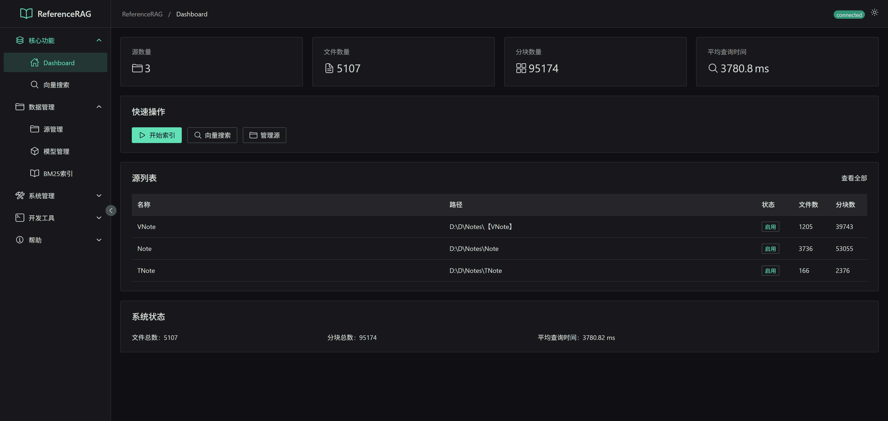
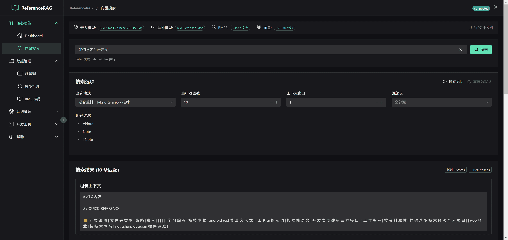
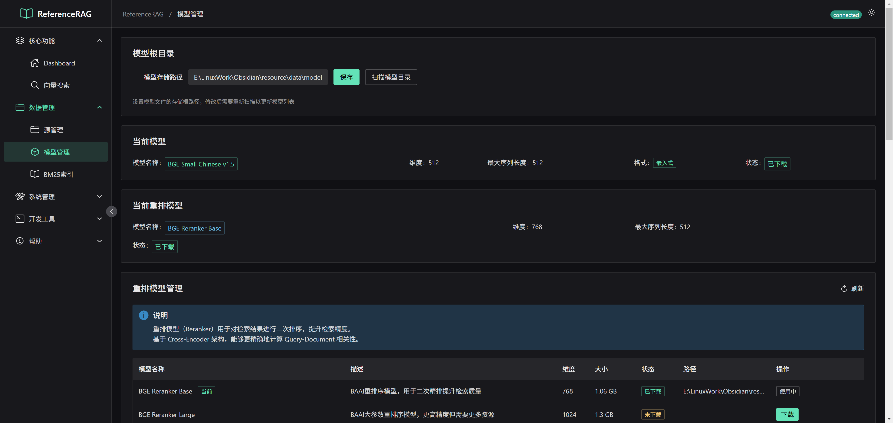
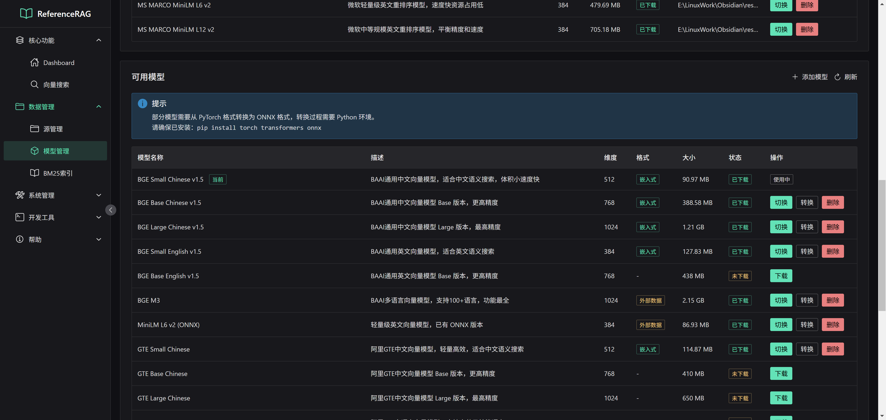
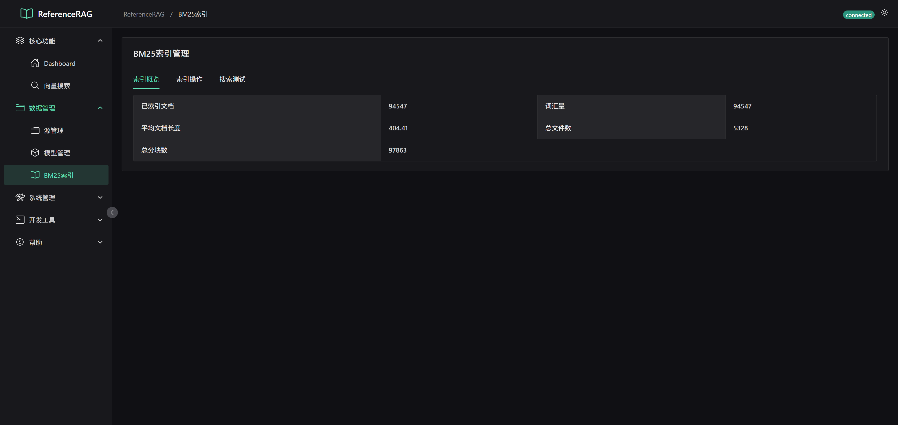
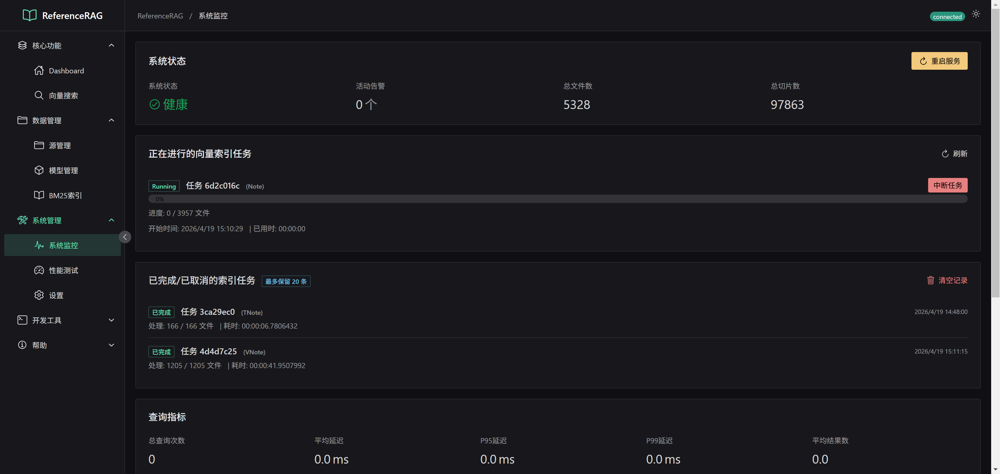
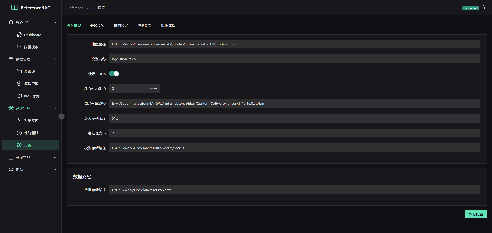
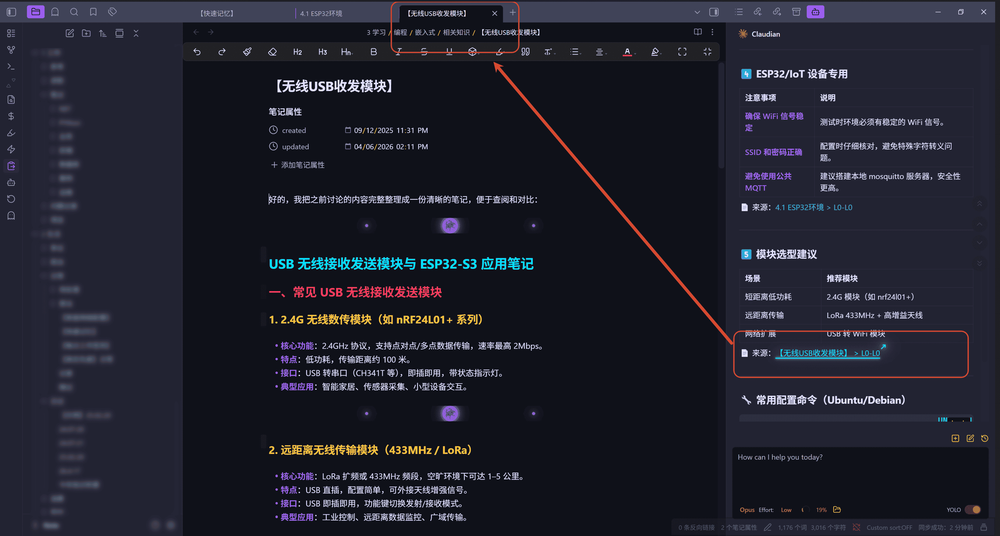
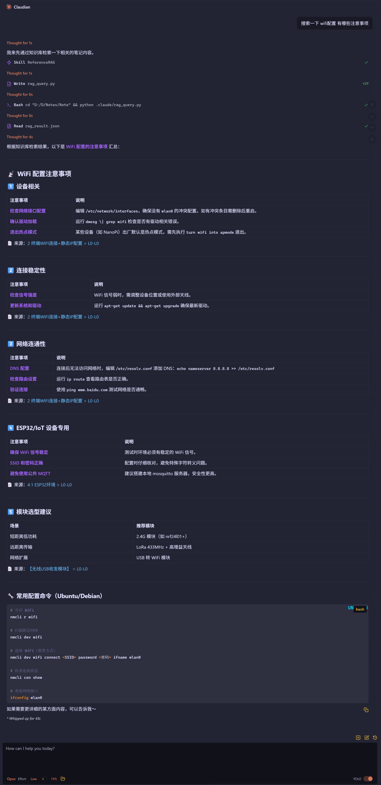

# ReferenceRAG 功能预览

ReferenceRAG 是一个 Obsidian 知识库 RAG（检索增强生成）系统，提供完整的向量索引、混合搜索和知识库管理能力。

---

## 目录

- [首页仪表盘](#首页仪表盘)
- [向量搜索](#向量搜索)
- [模型管理](#模型管理)
- [BM25 索引](#bm25-索引)
- [源管理](#源管理)
- [系统监控](#系统监控)
- [系统设置](#系统设置)
- [使用指南](#使用指南)

---

## 首页仪表盘

展示系统核心指标的统计卡片，包括：
- **源数量**：已配置的知识库源数量
- **文件数量**：已索引的文件总数
- **分块数量**：文档切分后的向量分块总数
- **平均查询时间**：历史查询的平均响应时间（ms）

快速操作区提供：
- **开始索引**：一键启动全量向量索引任务
- **向量搜索**：跳转到搜索页面
- **管理源**：跳转到源管理页面

底部实时显示索引进度，包括每个源的完成百分比、当前处理文件名及错误信息。

---

## 向量搜索

混合检索界面，支持多种索引类型的状态展示：
- **嵌入模型**：当前加载的 embedding 模型及维度
- **重排模型**：是否启用及其名称
- **BM25 索引**：已索引文档数量
- **向量索引**：已索引的分块数量
- **总文件数**：当前知识库中的文件总数

搜索功能：
- 支持 `Enter` 快捷搜索，`Shift+Enter` 换行
- 实时清除查询内容
- 混合搜索模式融合 BM25 和向量检索结果
- 每条结果展示来源文件、相关度分数、关键词高亮
- 点击可展开查看完整分块内容

---

## 模型管理

### 模型列表

支持管理的模型类型：
- **嵌入模型（Embedding）**：用于将文本转换为向量表示
- **重排模型（Reranker）**：对检索结果进行二次排序优化

功能特性：
- **模型扫描**：自动扫描本地模型目录
- **模型下载**：从 HuggingFace 在线下载模型
- **模型切换**：一键切换当前使用的嵌入/重排模型
- **ONNX 加速**：支持 ONNX 格式加速推理

### 模型详情

每个模型卡片展示：
- 模型名称及显示名称
- 向量维度（如 1024d、768d）
- 最大序列长度
- 模型格式（ONNX / GGUF / SafeTensors）
- 下载状态（已下载 / 未下载）
- 一键下载 / 切换操作

---

## BM25 索引

基于关键词的传统全文检索管理界面：
- 独立的 BM25 索引构建与管理
- 支持指定分块大小和重叠长度
- 索引状态监控
- 索引重建与更新

---

## 源管理

Obsidian 知识库源配置与管理：

- **添加源**：输入文件夹绝对路径，设置源名称和递归扫描选项
- **向量索引管理**：查看当前索引模型、维度、文件数、分块数
- **模型统计表**：按模型分类显示各分块的文件数量
- **文件列表**：展示已索引文件的路径、状态、更新时间等信息
- **删除源**：移除不需要的知识库源

---

## 系统监控

实时系统状态监控面板：

- **系统状态指示**：运行中 / 已停止 / 告警状态，通过颜色直观区分
- **活动告警数**：当前活跃的告警事件数量
- **总文件数 / 总切片数**：全局索引统计
- **正在进行的索引任务列表**：每个任务的实时进度、完成状态、错误信息
- 支持手动刷新任务列表

---

## 系统设置

系统级配置选项：

- **向量索引参数**：
  - 分块大小（Chunk Size）
  - 分块重叠（Chunk Overlap）
  - 删除索引重建
- **搜索参数**：
  - 混合搜索权重配置
  - Top-K 召回数量
  - 重排数量
  - BM25 参数（k1、b）
- **日志级别**：配置系统日志详细程度
- **API Key 管理**：配置 LLM API 密钥

---

## 使用指南

### 环境安装

提供完整的环境配置指引：

**前置条件**：
- .NET Runtime 10.0（必须）
- CUDA（可选，用于 GPU 加速）
- 模型存储位置默认：`~/.cache/huggingface/hub`

**模型下载步骤**：
1. 进入「模型管理」页面
2. 在推荐模型列表中选择需要的模型
3. 点击「下载」按钮开始下载
4. 下载完成后点击「使用」切换模型

**Obsidian 插件配置**：
- 安装 Obsidian RAG 插件
- 配置服务地址（默认 `http://localhost:5000`）
- 验证连接状态

### Obsidian 提问

在 Obsidian 中使用 RAG 功能：
- 直接在笔记中提问
- 自动从知识库中检索相关内容
- 展示带来源标注的答案
- 支持引用跳转到原始笔记
