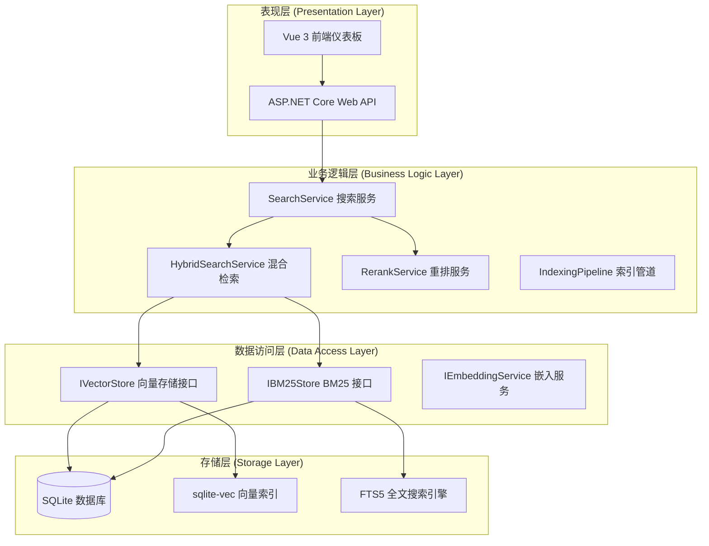

# ReferenceRAG

> 本地优先、高召回率、低延迟的知识库 RAG 系统 - **支持多源文件夹，不限于 Obsidian**

基于 ASP.NET Core + ONNX Runtime + SQLite 向量存储构建，集成 MCP 工具集支持 Claude Code，提供完整的知识库检索与管理解决方案。

## 🖼️ 功能预览

> 📸 完整截图预览，包含所有页面效果：**[PREVIEW.md](PREVIEW.md)**

---

> **重点提示** - 模型下载需要安装依赖：
> ```bash
> pip install torch transformers optimum onnx numpy
> ```

---

## ✨ 核心特性

- 🚀 **高性能检索**: 检索延迟 P95 ≤ 50ms，召回率 ≥ 85%
- 📁 **多源支持**: 同时索引多个文件夹（Obsidian/Markdown/代码文档/自定义）
- 📊 **层级检索**: 文档 → 章节 → 分段三级检索，精准定位内容
- 🔀 **混合检索**: 向量语义检索 + BM25 全文检索 + Rerank 重排
- 🔄 **实时监控**: 内置指标采集、告警规则与性能分析
- 🔗 **智能链接**: 自动生成 Obsidian 兼容链接 `[[file#L10-L20]]`
- 🤖 **MCP 集成**: Claude Code 工具链，AI 对话中直接查询知识库
- 🐳 **容器化部署**: Docker/docker-compose 一键部署
- 📈 **Web 仪表板**: Vue 3 前端，可视化管理与监控

## 🏗️ 系统架构

ReferenceRAG 采用四层分层架构设计，通过依赖注入和接口抽象实现高度模块化：



### 项目结构

```
ReferenceRAG/
├── dashboard-vue/                    # Vue 3 前端仪表板
│   ├── src/views/                    # 功能页面（Dashboard/Search/Settings等）
│   ├── src/api/                      # API 客户端封装
│   └── src/stores/                   # Pinia 状态管理
├── src/
│   ├── ReferenceRAG.Service/         # ASP.NET Core Web API 服务
│   │   ├── Controllers/              # RESTful API 控制器
│   │   ├── McpTools/                 # MCP 工具集（Claude Code 集成）
│   │   ├── Hubs/                     # SignalR 实时通信
│   │   └── Middleware/               # 中间件
│   ├── ReferenceRAG.Core/            # 核心业务逻辑
│   │   ├── Services/                 # 服务层实现
│   │   │   ├── Search/              # 搜索服务（混合/层级/上下文扩展）
│   │   │   ├── Embedding/           # 嵌入服务（ONNX 推理）
│   │   │   ├── Rerank/              # 重排服务（交叉编码）
│   │   │   ├── Indexing/            # 索引管道（分段→嵌入→写入）
│   │   │   └── Monitoring/          # 监控与告警
│   │   ├── Interfaces/              # 接口抽象
│   │   └── Models/                  # 领域模型
│   └── ReferenceRAG.Storage/         # 存储层实现
│       ├── SqliteVectorStore.cs      # SQLite 向量存储
│       └── Fts5BM25Store.cs          # FTS5 BM25 全文检索
├── tests/                            # 单元测试与集成测试
├── resource/                         # 资源文件与脚本
├── Dockerfile                        # Docker 镜像构建
└── docker-compose.yml                # 容器编排
```

## 🚀 快速开始

### 环境要求

- **.NET 10.0 SDK** 或更高版本
- **Node.js 18+** （仅开发前端时需要）
- **SQLite** （自动包含，无需单独安装）
- **CUDA 12.x** （可选，用于 GPU 加速）

### 1. 克隆项目

```bash
git clone https://github.com/your-repo/ReferenceRAG.git
cd ReferenceRAG
```

### 2. 恢复依赖

```bash
dotnet restore
```

### 3. 配置数据源

编辑 `src/ReferenceRAG.Service/appsettings.json` 配置文件：

```json
{
  "DataPath": "data",
  "Sources": [
    {
      "Name": "我的笔记",
      "Path": "C:\\Users\\YourName\\Documents\\Notes",
      "Type": "obsidian"
    },
    {
      "Name": "技术文档",
      "Path": "D:\\Docs\\Technical",
      "Type": "markdown"
    }
  ],
  "Embedding": {
    "ModelPath": "models/bge-small-zh-v1.5.onnx",
    "UseCuda": false
  },
  "Search": {
    "DefaultTopK": 10,
    "ContextWindow": 1,
    "EnableRerank": true
  }
}
```

### 4. 下载向量模型（可选）

系统支持自动下载模型，也可手动下载：

```bash
# 使用内置脚本下载
dotnet run --project src/ReferenceRAG.Service -- download-model
```

> 如果不下载模型，系统会自动使用模拟模式进行测试。

### 5. GPU 加速配置（可选）

要启用 GPU 加速，需要安装 **CUDA 12.x**：

1. **下载 CUDA Toolkit 12.x**
   
   下载地址：https://developer.nvidia.com/cuda-downloads

2. **安装后重启电脑**

3. **验证安装**：
   ```bash
   nvcc --version
   nvidia-smi
   ```

4. **启用 GPU**：编辑配置文件设置 `Embedding.UseCuda: true`

### 6. 启动服务

```bash
dotnet run --project src/ReferenceRAG.Service
```

服务将在 `http://localhost:7897` 启动（端口可在配置中调整）。

### 7. 索引文档

通过 API 触发索引：

```bash
# 触发所有源索引
curl -X POST http://localhost:7897/api/index/all

# 强制重新索引
curl -X POST http://localhost:7897/api/index/reindex

# 查看索引状态
curl http://localhost:7897/api/index/status
```

### 8. 测试查询

```bash
# 查询所有源
curl -X POST http://localhost:7897/api/ai/query \
  -H "Content-Type: application/json" \
  -d '{"query": "如何配置？", "mode": "standard"}'

# 限定源查询
curl -X POST http://localhost:7897/api/ai/query \
  -H "Content-Type: application/json" \
  -d '{"query": "关键词", "sources": ["我的笔记"]}'
```

### 9. 访问前端仪表板

打开浏览器访问 `http://localhost:7897`，使用 Vue 3 前端仪表板进行可视化管理。

## 📖 API 接口文档

### AI 查询接口

#### 标准查询

```http
POST /api/ai/query
Content-Type: application/json

{
  "query": "如何配置 Obsidian？",
  "mode": "standard",
  "topK": 10,
  "sources": []  // 空数组表示查询所有源
}
```

**查询模式**:
- `quick`: 快速模式，~1000 tokens，返回 3 个结果
- `standard`: 标准模式，~3000 tokens，返回 10 个结果（默认）
- `deep`: 深度模式，~6000 tokens，返回 20 个结果

**响应示例**:

```json
{
  "query": "如何配置 Obsidian？",
  "mode": "standard",
  "context": "...",
  "chunks": [
    {
      "refId": "@1",
      "filePath": "notes/obsidian-config.md",
      "content": "...",
      "score": 0.89,
      "obsidianLink": "[[obsidian-config#L45-L52]]"
    }
  ],
  "stats": {
    "totalMatches": 10,
    "durationMs": 23,
    "estimatedTokens": 2847
  }
}
```

#### 深入查询（上下文扩展）

```http
POST /api/ai/drill-down
Content-Type: application/json

{
  "query": "如何配置 Obsidian？",
  "refIds": ["@1", "@2"],
  "expandContext": 2
}
```

### 索引管理接口

```http
# 触发所有源索引
POST /api/index/all

# 触发指定源索引
POST /api/index/{sourceName}

# 强制重新索引
POST /api/index/reindex

# 查看索引状态
GET /api/index/status

# 获取索引统计
GET /api/index/stats
```

### 系统管理接口

```http
# 系统状态
GET /api/system/status

# 健康检查
GET /api/system/health

# 获取配置
GET /api/settings

# 更新配置
PUT /api/settings
```

### 模型管理接口

```http
# 列出可用模型
GET /api/models

# 下载模型
POST /api/models/download

# 切换模型
POST /api/models/switch

# 性能指标
GET /api/performance/stats
```

### 数据源管理接口

```http
# 列出所有数据源
GET /api/sources

# 添加数据源
POST /api/sources

# 删除数据源
DELETE /api/sources/{sourceName}

# 扫描数据源
POST /api/sources/{sourceName}/scan
```

## 🐳 Docker 部署

### 使用 Dockerfile

```bash
# 构建镜像
docker build -t reference-rag .

# 运行容器
docker run -d \
  --name reference-rag \
  -p 7897:7897 \
  -v ./data:/app/data \
  -v ./models:/app/models \
  -v /path/to/vault:/app/vault:ro \
  reference-rag
```

### 使用 docker-compose

创建 `docker-compose.yml`：

```yaml
version: '3.8'
services:
  reference-rag:
    build: .
    ports:
      - "7897:7897"
    volumes:
      - ./data:/app/data
      - ./models:/app/models
      - /path/to/notes:/app/vault:ro
    environment:
      - ASPNETCORE_ENVIRONMENT=Production
      - DataPath=/app/data
      - ModelPath=/app/models/bge-small-zh-v1.5.onnx
    restart: unless-stopped
```

启动服务：

```bash
docker-compose up -d
```

### GPU 支持

使用 `Dockerfile.gpu` 构建支持 GPU 的镜像：

```bash
docker build -f Dockerfile.gpu -t reference-rag-gpu .
docker run -d --gpus all -p 7897:7897 reference-rag-gpu
```

## 🔧 配置管理

### 环境变量

| 变量 | 说明 | 默认值 |
|------|------|--------|
| `ASPNETCORE_ENVIRONMENT` | 运行环境 | `Production` |
| `DataPath` | 数据存储路径 | `data` |
| `ModelPath` | ONNX 模型路径 | `models/bge-small-zh-v1.5.onnx` |
| `ASPNETCORE_URLS` | 监听地址 | `http://localhost:7897` |

### appsettings.json 核心配置

```json
{
  "DataPath": "data",
  "Sources": [
    {
      "Name": "笔记",
      "Path": "/path/to/vault",
      "Type": "obsidian",
      "WatchForChanges": true
    }
  ],
  "Embedding": {
    "ModelPath": "models/bge-small-zh-v1.5.onnx",
    "UseCuda": false,
    "BatchSize": 32
  },
  "Chunking": {
    "MaxTokens": 512,
    "MinTokens": 50,
    "Overlap": 50
  },
  "Search": {
    "DefaultTopK": 10,
    "ContextWindow": 1,
    "EnableRerank": true,
    "RerankTopN": 50
  },
  "Monitoring": {
    "EnableMetrics": true,
    "AlertThresholds": {
      "P95LatencyMs": 100,
      "MaxMemoryGB": 2
    }
  }
}
```

### 配置层次

ReferenceRAG 支持多层级配置（优先级从高到低）：
1. 环境变量
2. `appsettings.{Environment}.json`
3. `appsettings.json`
4. 默认配置

## 🌐 Web 前端仪表板

ReferenceRAG 提供功能完整的 Vue 3 前端仪表板，支持可视化管理和监控。

### 核心功能页面

| 页面 | 功能 |
|------|------|
| **Dashboard** | 系统概览、实时指标、快速操作 |
| **Search** | 交互式搜索、结果展示、上下文扩展 |
| **Sources** | 数据源管理、添加/删除/扫描 |
| **Models** | 模型下载、切换、性能对比 |
| **Settings** | 系统配置、参数调整 |
| **System** | 系统状态、健康检查、日志 |
| **Performance** | 性能分析、查询统计、延迟分布 |
| **BM25 Index** | BM25 索引管理 |

### 技术栈

- **Vue 3** + TypeScript
- **Naive UI** 组件库
- **Pinia** 状态管理
- **Vue Router** 路由管理
- **SignalR** 实时通信（索引进度推送）
- **Axios** HTTP 客户端

### 访问方式

启动服务后访问 `http://localhost:7897` 即可使用前端仪表板。

## 📊 监控与告警

### 系统指标

- CPU 使用率
- 内存使用量（含 GC 统计）
- 线程数
- 运行时间
- 磁盘使用量

### 索引指标

- 总文件数
- 总分段数（Chunks）
- 总 token 数
- 索引时间范围
- 索引速度（文件/秒）

### 查询指标

- 查询总数（按模式统计）
- 平均延迟
- P50/P95/P99 延迟
- 平均结果数
- 召回率估算

### 告警规则

| 规则 | 条件 | 严重程度 |
|------|------|----------|
| HighQueryLatency | P95 延迟 > 100ms | Warning |
| HighMemoryUsage | 内存 > 2GB | Warning |
| LowRecall | 平均结果 < 3 | Info |
| IndexStale | 索引超过 24 小时未更新 | Warning |

### 查询统计

系统自动记录查询历史，支持：
- 热门查询词统计
- 查询频率分析
- 零结果查询检测
- Token 使用量统计

## 🔗 MCP 工具集成

### Claude Code 配置

ReferenceRAG 提供完整的 MCP（Model Context Protocol）工具集，可在 Claude Code 中直接调用：

#### 可用 MCP 工具

| 工具 | 功能 | 示例 |
|------|------|------|
| `sources-list` | 列出所有数据源 | 查看已索引的笔记库 |
| `sources-add` | 添加新数据源 | 添加新的知识库路径 |
| `query-knowledge` | 知识库语义查询 | "搜索 React Hooks 最佳实践" |
| `search-files` | 文件内容搜索 | "查找包含 useEffect 的文件" |
| `run-script` | 执行自定义脚本 | 运行索引刷新脚本 |
| `get-embedding` | 获取文本向量 | 用于向量相似度计算 |

#### 使用示例

在 Claude Code 对话中：

```
使用 query-knowledge 工具搜索："如何配置 Docker 部署？"
```

系统会返回相关知识片段，包含：
- 精确的文本内容
- 来源文件路径
- Obsidian 兼容链接
- 相关性评分

详见 MCP 工具源码：`src/ReferenceRAG.Service/McpTools/`

### Obsidian 自动链接

系统自动生成 Obsidian 兼容链接格式：

```
[[filename#L10-L20]]          # 行号链接
[[filename#heading]]          # 标题链接
[[filename#^block-id]]        # 块 ID 链接
```

点击链接可直接在 Obsidian 中定位到具体内容。

> **Obsidian 使用插件**：推荐使用 [claudian](https://github.com/YishenTu/claudian)，可在 Obsidian 内直接调用 Claude 进行 RAG 问答。

## 🧪 测试

```bash
# 运行所有测试
dotnet test

# 运行特定测试类
dotnet test --filter "FullyQualifiedName~MarkdownChunkerTests"

# 运行集成测试
dotnet test --filter "Category=Integration"

# 生成代码覆盖率报告
dotnet test /p:CollectCoverage=true /p:CoverletOutputFormat=lcov
```

### 测试覆盖范围

- ✅ 单元测试：核心算法、工具类、模型处理
- ✅ 集成测试：数据库操作、API 端点、文件系统
- ✅ 性能测试：检索延迟、吞吐量、内存使用
- ✅ 边界测试：空输入、大文件、特殊字符

## 🐛 服务管理

### Windows 服务

```powershell
# 安装服务（需要管理员权限）
.\resource\install-service.ps1

# 查看服务状态
.\resource\status.ps1

# 停止服务（需要管理员权限）
Stop-Service ReferenceRAG.Service

# 卸载服务（需要管理员权限）
.\resource\uninstall-service.ps1
```

### Linux systemd 服务

```bash
# 安装服务
cd src/ReferenceRAG.Service/scripts
sudo ./install-service.sh

# 管理服务
sudo systemctl start reference-rag
sudo systemctl stop reference-rag
sudo systemctl restart reference-rag
sudo systemctl status reference-rag

# 查看日志
sudo journalctl -u reference-rag -f

# 使用控制脚本
./servicectl.sh status/start/stop/restart/logs
```

## 📚 详细文档

项目包含完整的技术文档，位于以下目录：

- **[.planning/codebase/](.planning/codebase/)** - 代码库架构分析
  - `ARCHITECTURE.md` - 系统架构
  - `STACK.md` - 技术栈详情
  - `STRUCTURE.md` - 项目结构
  - `CONVENTIONS.md` - 编码规范

- **[.planning/intel/](.planning/intel/)** - 项目情报文件

- **Wiki** - 完整的项目 Wiki 文档，包括：
  - 项目概述与快速开始
  - 系统架构设计（四层架构详解）
  - 核心功能模块（搜索、索引、模型、存储）
  - API 接口文档（完整参考）
  - 前端仪表板系统
  - 配置管理指南
  - 监控与告警系统
  - MCP 工具集成
  - 部署与运维
  - 测试策略
  - 故障排除指南
## 🛠️ 技术栈

### 后端

- **ASP.NET Core 10** - Web API 框架
- **ONNX Runtime** - 本地模型推理（CPU/GPU）
- **SQLite + sqlite-vec** - 向量存储与检索
- **FTS5** - 全文搜索引擎
- **SignalR** - 实时通信

### 前端

- **Vue 3** - 渐进式 JavaScript 框架
- **TypeScript** - 类型安全
- **Naive UI** - Vue 3 组件库
- **Pinia** - 状态管理
- **Vite** - 前端构建工具

### 核心算法

- **BGE-small-zh-v1.5** - 中文向量模型
- **BM25** - 概率检索模型
- **Cross-Encoder Rerank** - 重排算法
- **Hierarchical Search** - 层级检索
- **Context Expansion** - 上下文扩展

### 部署与运维

- **Docker** - 容器化
- **docker-compose** - 容器编排
- **Windows Service** - Windows 服务
- **systemd** - Linux 服务管理

## 🤝 贡献指南

欢迎提交 Issue 和 Pull Request！

### 开发流程

1. Fork 本仓库
2. 创建特性分支 (`git checkout -b feature/AmazingFeature`)
3. 提交更改 (`git commit -m 'Add some AmazingFeature'`)
4. 推送到分支 (`git push origin feature/AmazingFeature`)
5. 提交 Pull Request

### 编码规范

- 遵循 C# 编码规范
- 所有公共 API 需要 XML 文档注释
- 新功能需要包含单元测试
- 提交信息遵循 Conventional Commits 规范

## 📄 许可证

MIT License - 详见 [LICENSE](LICENSE) 文件

## 🙏 致谢

- [sqlite-vec](https://github.com/asg017/sqlite-vec) - SQLite 向量扩展
- [ONNX Runtime](https://onnxruntime.ai/) - 跨平台机器学习推理加速器
- [BAAI/bge-small-zh-v1.5](https://huggingface.co/BAAI/bge-small-zh-v1.5) - 北京智源人工智能研究院
- [Naive UI](https://www.naiveui.com/) - Vue 3 组件库

## 📞 支持与反馈

- 📧 提交 [Issue](https://github.com/your-repo/ReferenceRAG/issues)
- 💬 参与讨论
- ⭐ 如果这个项目对您有帮助，请给个 Star！
