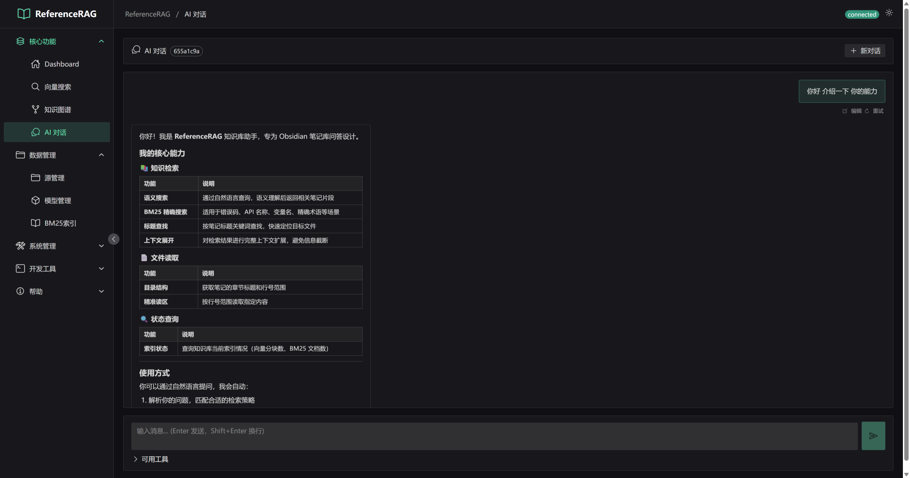

# ReferenceRAG

面向本地知识库的 RAG 系统，把本地文件夹、笔记库、文档接入统一的检索增强流程，为 AI 应用提供外挂知识库能力。

当前仓库已包含后端服务、桌面端、前端仪表盘、存储层、核心检索逻辑、测试工程和部署脚本，整体是一个可运行的完整项目，而非概念验证。

---

## 产品定位

| 角色 | 用途 |
|------|------|
| 用户 | 快速检索个人笔记库、文档库 |
| Agent | 通过 Skill / MCP / API 获取知识库内容 |
| 应用 | 集成检索能力，增强 AI 回答质量 |

---

## 核心特性

### AI 对话查询

内置聊天式查询界面，直接向知识库提问：



- 自然语言输入，无需掌握搜索语法
- 自动调用检索工具，从知识库获取答案
- 支持多轮对话，追问、细化、切换话题
- 注明来源笔记，答案可追溯
- 自动扩展模糊查询，提升召回率

适用场景：
- "笔记里有没有关于 Docker 配置的内容？"
- "帮我找一下 Git 分支管理的最佳实践"
- "上次记录的那个问题排查步骤是什么？"

### 自动索引
- 监听本地文件夹（md + txt），自动切片向量化
- 文件变更实时同步，无需手动触发
- Markdown 分块、知识图谱自动构建

### 多路召回优化
嵌入式模型 + BM25 + 重排模型 + 知识图谱组合，提升召回准确率：

| 路径 | 优势 | 适用场景 |
|------|------|----------|
| 嵌入式模型 | 语义理解 | "怎么配置 Docker 网络" |
| BM25 | 关键词精确匹配 | "IndexOutOfRangeException" |
| 重排模型 | 精排序 Top-N | 混合检索后的二次排序 |
| 知识图谱 | 文档关联扩展 | 探索笔记间的引用关系 |

### 灵活过滤
按源名称或文件夹路径过滤，让 AI 只检索指定知识范围。

### 多种接入方式

| 方式 | 适用场景 | 说明 |
|------|----------|------|
| **AI 对话** | 聊天式查询 | Web/桌面端内置，直接提问 |
| **桌面端** | 日常使用 | 开箱即用，WPF + WebView2 |
| **Web 仪表盘** | 浏览器访问 | Vue 3 + Naive UI |
| **MCP 工具** | CherryStudio、Claude Code | MCP 协议调用 |
| **Skill** | Claude Code | 内置检索技能 |
| **REST API** | 脚本、集成 | 标准 HTTP 接口 |

---

## 目录结构

```
ReferenceRAG/
├── src/
│   ├── ReferenceRAG.Core/        # 核心检索、索引、重排、模型管理
│   ├── ReferenceRAG.Storage/     # SQLite 向量存储、BM25、图谱存储
│   ├── ReferenceRAG.Service/     # Web API、MCP、SignalR、后台任务
│   └── ReferenceRAG.Desktop/     # WPF 桌面端壳
├── dashboard-vue/                # Vue 3 前端仪表盘
├── tests/                        # 单元测试、集成测试、性能测试
├── config/                       # 容器运行时配置
├── data/                         # 本地索引与运行时数据
├── models/                       # 模型文件目录
└── skill/ReferenceRAG/           # Claude Code Skill
```

---

## 快速开始

### 1. 桌面端（推荐）

1. 下载 `ReferenceRAG-win-x64.zip`
2. 解压运行 `ReferenceRAG.Desktop.exe`
3. 自动打开 `http://localhost:7897`
4. 进入 **Chat** 页面，直接向知识库提问

**特性：**
- 启动后自动拉起服务并打开界面
- 关闭窗口最小化到托盘
- 支持单实例、开机自启动
- 端口占用自动回退

**系统要求：** WebView2 Runtime

### 2. 本地开发

**前提：** .NET 10 SDK、Node.js、npm

```bash
dotnet run --project src/ReferenceRAG.Service
# 或
dotnet run --project src/ReferenceRAG.Desktop
```

### 3. Windows 服务管理

```bat
cd src/ReferenceRAG.Service/scripts
menu.bat
```

功能：构建、安装/卸载服务、启动/停止、查看状态、控制台运行、打开浏览器、查看日志。

---

## Web 仪表盘

Vue 3 + Vite + Naive UI 构建的前端界面：

| 页面 | 功能 |
|------|------|
| **Chat** | AI 对话查询，聊天式检索 |
| Dashboard | 索引统计、模型状态、系统概览 |
| Search | 语义搜索、混合搜索、结果预览 |
| Graph | 知识图谱可视化 |
| Sources | 源文件夹管理 |
| Models | 模型管理、切换、下载 |
| Settings | 配置管理 |
| BM25 Index | BM25 索引管理 |
| Performance | 性能测试 |

---

## 核心能力

### 检索
- 向量检索
- BM25 全文检索
- 混合检索（分数级加权融合）
- 可选重排
- 同义词扩展

### 索引
- 自动后台索引
- 启动时同步
- 文件变更监控
- Markdown 分块
- 知识图谱更新

### 模型管理
- Embedding / Reranker 模型管理
- ONNX 推理
- CUDA 加速
- OpenAI 兼容 API 模式

### 服务能力
- REST API
- MCP 工具集
- Swagger 文档
- SignalR 实时通知
- Windows Service 适配

---

## 配置要点

| 配置项 | 说明 |
|--------|------|
| `ReferenceRAG:Service:port` | 服务端口，默认 7897 |
| `ReferenceRAG:Service:apiKey` | API 密钥，留空关闭鉴权 |
| `ReferenceRAG:dataPath` | 数据目录 |
| `ReferenceRAG:modelsRootPath` | 模型文件目录 |
| `ReferenceRAG:sources` | 知识源配置列表 |

配置文件：
- `src/ReferenceRAG.Service/appsettings.json`
- 桌面端发布目录下的 `appsettings.json`

---

## 支持的模型

**本地 ONNX Embedding：** bge-small-zh-v1.5、bge-base-zh-v1.5、bge-large-zh-v1.5、bge-m3  
**本地 ONNX Rerank：** bge-reranker-base、bge-reranker-large  
**OpenAI 兼容 API：** Ollama、vLLM、Xinference、LM Studio、TEI 等

---

## 数据存储

- `vectors.db`：向量、BM25、图谱数据
- `query_stats.db`：查询统计
- 模型文件目录
- 索引日志和运行日志

迁移环境时需携带 `data/` 和 `models/` 目录。

---

## API 与使用文档

- **Swagger：** `http://localhost:7897/swagger`
- **Skill 文档：** [skill/ReferenceRAG/SKILL.md](skill/ReferenceRAG/SKILL.md)
- **使用预览：** [PREVIEW.md](PREVIEW.md)

---

## 更新历史

### AI 对话功能（MafChat）
- **feat:** AI 对话功能（MafChat）+ 前端路由/导航集成
- **fix:** MafChat 会话保持 + 工具列表 API + UI 优化
- **feat:** Chat 页面交互优化 + 移除源递归扫描选项

### 架构重构
- **refactor:** 按业务域重组文件夹结构（保持命名空间不变）
- **refactor:** 完成领域内聚重构 - 接口隔离 + internal 修饰符
- **refactor:** 用领域 DI 扩展方法替换 Program.cs 手工注册（~200行→~25行业务注册）
- **refactor:** 统一包版本管理 - Directory.Packages.props

### 搜索优化
- **feat:** 替换 BM25 中文分词为 jieba.NET 词语级分词
- **feat:** 搜索召回优化 + Agent API 扩展 + 图谱修复
- **feat:** 添加向量搜索链路追踪（Rougamo AOP）
- **perf:** 召回率全链路优化（5项）

### 知识图谱
- **feat:** 知识图谱接入搜索管道（Graph-enhanced RAG）
- **feat:** 知识图谱 tag/heading/external 节点支持
- **feat:** 知识图谱页面 — 独立重建按钮 + 可视化
- **perf:** 图谱写入单次锁+单事务（N×锁 → 1×锁）

### OpenAI API 模式
- **feat:** 支持 OpenAI 兼容 API 作为嵌入/重排模型后端
- **fix:** 嵌入/重排模型 API 模式显示修复

### 索引优化
- **feat:** 前端新增「补全缺失向量」按钮（全局+按源）
- **fix:** 修复索引并发竞态及孤儿向量问题
- **refactor:** 引入 FileIndexPipeline 统一单文件索引/删除逻辑
- **fix:** 修复6个索引数据一致性问题

### 桌面端
- **feat:** 新增桌面端 WPF 应用
- **feat:** 桌面端功能增强及模型转换修复
- **fix:** 桌面端前端缓存修复 + WebView2 优化

### API 精简
- **refactor:** 精简 API 端点结构（27→16 累引相关端点）
- **refactor:** 累引 controller 合并，删除冗余端点